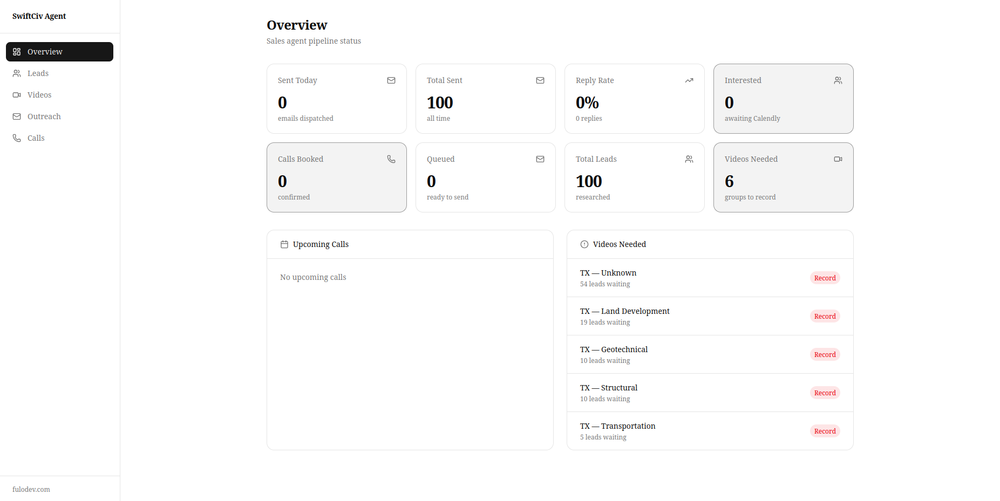

# Civ Lead Scraper + Sales Agent

Automated lead generation and outreach pipeline for civil engineering firms across the USA. Scrapes 150-300 fresh firms daily, classifies them by document type using Grok(LLM), and runs a fully automated email outreach sequence — research, personalise, send, follow up, book calls.

## How it works

The scraper runs every morning at 8am and finds civil engineering firms via Google Places across rotating US cities. Each lead is enriched with contact details, and pushed to HubSpot.

The sales agent then takes over automatically. It classifies each company by the type of regulatory documents they work with (stormwater, structural, land development, etc.), generates a personalised cold email referencing a SwiftCiv tutorial demo video recorded for that state and document type, and sends it via Gmail. If there's no reply it follows up three times over 14 days. Interested prospects get a Calendly link. Booked calls trigger a Telegram alert.

The only manual steps are recording demo videos when the agent asks and showing up to booked calls.

## Tech stack

- Python — core language
- Google Places API — primary data source for civil engineering firms
- Playwright — headless browser for website contact extraction
- HubSpot API — CRM for all leads
- Grok API — classifies companies by document type and writes personalised emails
- Gmail API — sends all outreach emails via OAuth2
- Calendly API — syncs booked calls
- SQLite — two databases: lead deduplication and agent pipeline state
- Celery + Redis — parallel task queue for scraping and scheduled agent pipelines
- FastAPI — dashboard backend API
- Telegram Bot — daily reports and booking alerts
- Docker — multi-stage containerised deployment
- Nginx + Let's Encrypt — reverse proxy with SSL
- Cron — scraper runs automatically at 8am daily

## Services

- redis — message broker for Celery
- scraper-worker — parallel Google Places searches
- agent-worker — research, email, monitor, follow up, booking pipelines
- beat — Celery Beat scheduler for all automated tasks
- dashboard — FastAPI backend for the sales agent dashboard
- scraper — run manually or via cron (profiles: run)

## Pipeline schedule

- 8am daily — scraper finds new leads
- Every 2 hours — research pipeline classifies leads with Grok
- Every hour — personalisation pipeline drafts emails
- Every hour — outreach pipeline sends queued emails
- Every 30 mins — monitor pipeline checks Gmail for replies
- Every hour — follow up pipeline sends follow ups
- Every 15 mins — booking pipeline syncs Calendly
- Daily — video notification tells you which demos to record
- Daily — pipeline performance report to Telegram

## Dashboard

The sales agent dashboard at `dashboard.fulodev.com` gives visibility into:

- Lead groups by state and document type
- Video library — paste YouTube demo URLs per group
- Outreach pipeline — email status, replies, follow ups
- Booked calls — upcoming calls and outcome tracking
